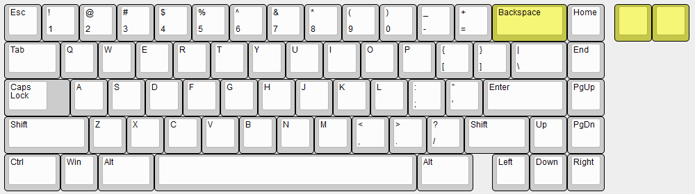
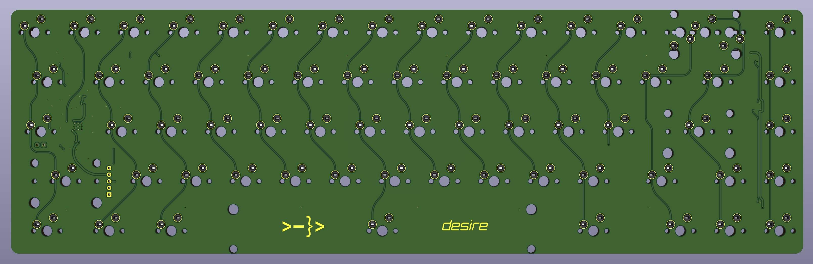
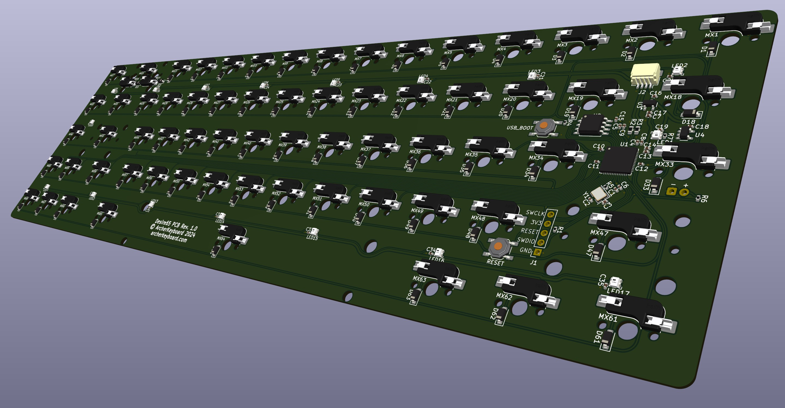
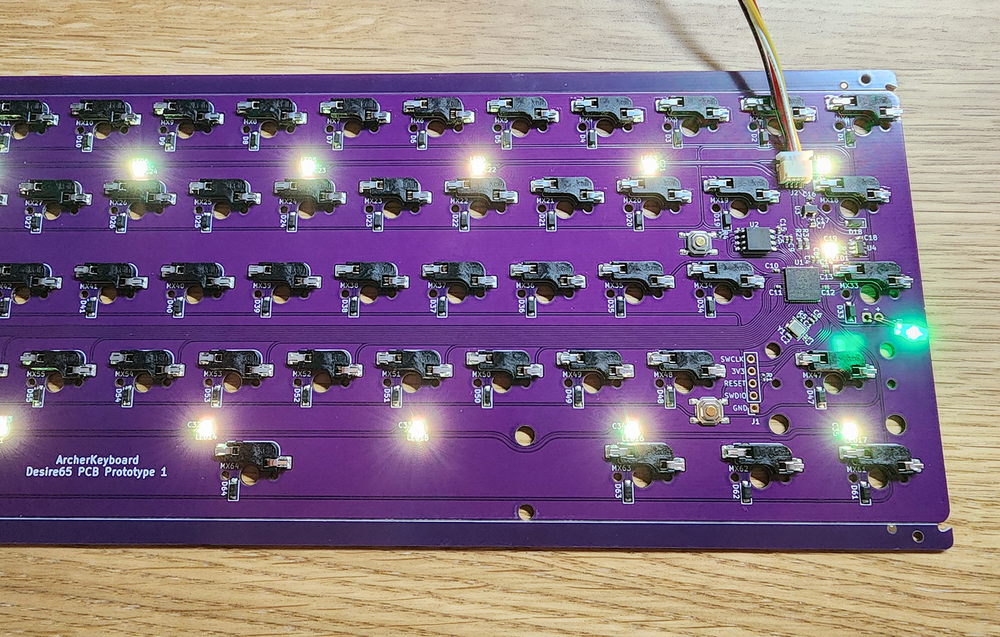
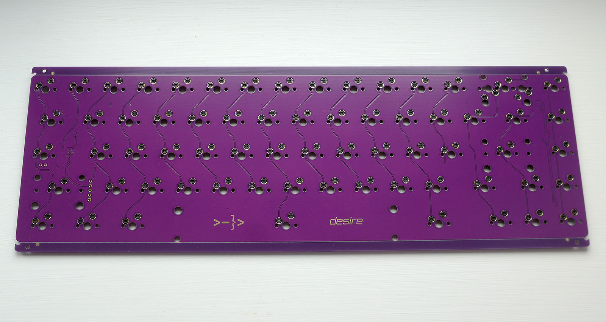
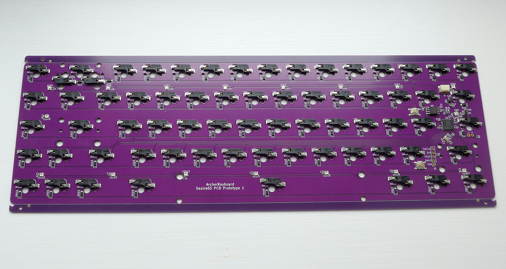
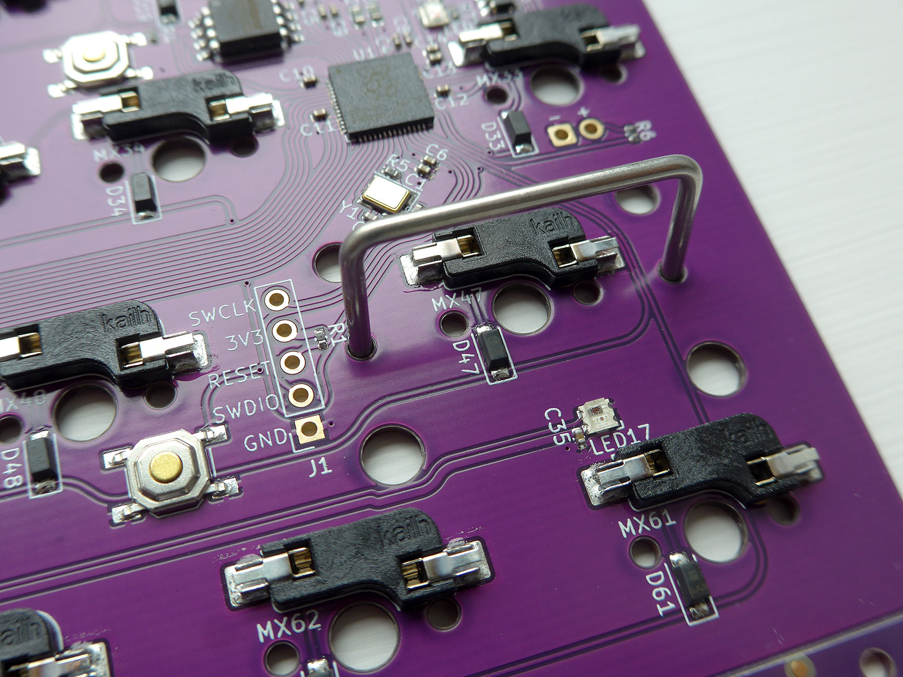

# desire65-pcb
 
 Open-source 65% hotswap pcb. Could be useful for keyboard designers looking for a PCB for gasket or top-mounted boards.
  
 ## Features
 
 - [UDB (Unified DB)](https://unified-daughterboard.github.io) compatibility (JST-SH variant)
 - Hotswap
 - Underglow RGB LEDs
 - Header for in-switch Caps Lock LED (currently configured in firmware as backlight)
 - RP2040 MCU
 - QMK/VIA/Vial firmware
 - Holes under 2u stabilizers to facilitate proper keycap installation on long-pole switches
 - Rounded tracks
 - [STEP file](./step/desire65-rounded.step) provided with all the components visible
 - Requires KiCad 8 to modify or produce production files
 - Font used: [Orbitron](https://fonts.google.com/specimen/Orbitron)
 
## Firmware
 - [VIAL](./release/via)

*QMK and VIA firmware to be provided*

## Supported Layout

## Renders

## Prototype Photos
1.2mm PCB produced by JLCPCB

## About the holes under 2u stabilizers
It is not easy to fully install a 2/2.25/2.75u keycap on the stabilizer stems when using a long-pole switch with reduced travel. Often one side will be inserted more than the other, causing rattle. The holes on the PCB allow the use of a spare 2u wire underneath to facilitate pushing the stabilizer stems fully into the keycap.

## Plugins Used

 - [marbastlib](https://github.com/ebastler/marbastlib)
 - [Round Tracks](https://github.com/mitxela/kicad-round-tracks)

## If you want to modify the PCB

 - Fork this repo
 - Changes to component placement and tracks must be made to **desire65.kicad_pcb** rather than **desire65-rounded.kicad_pcb**
 - When you're done, use the Round Tracks plugin with **create a new file option** checked to generate a new **desire65-rounded.kicad_pcb**
 - Open it and manually fix track-to-track and track-to-pad clearances. Use DRC to find them.
 - Feel free to ignore the generated **desire65-rounded.kicad_pro**

## Thanks to

 - **Sleepdealr** for the [RP2040 Design Guide](https://github.com/Sleepdealr/RP2040-designguide)
 - **ebastler** for the super-useful [marbastlib](https://github.com/ebastler/marbastlib)
 - **zykrah** for [KiCad KLE Placer](https://github.com/zykrah/kicad-kle-placer) and [Firmware Scripts](https://github.com/zykrah/firmware-scripts)
 - **ai03** for the [PCB Designer Guide](https://wiki.ai03.com/books/pcb-design/chapter/pcb-designer-guide)
 - Folks on Keyboard Atelier Discord

